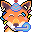
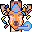
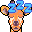

# Bananamoji - Pixel Art Stickers

Pixel art stickers expressing every emotion.

## License

See [LICENSE](LICENSE) for details.

Unless otherwise noted, the content is distributed under [Creative Commons
Attribution 4.0](https://creativecommons.org/licenses/by/4.0/).

### You are free to:

* Share — to copy and redistribute the material in any medium or format
* Adapt — remix, transform, and build upon the material for any purpose, even
  commercially.

The licensor cannot revoke these freedoms as long as you follow the license terms.

### Under the following conditions:

* Attribution — You must give appropriate credit, provide a link to the
  license, and indicate if changes were made. You may do so in any reasonable
  manner, but not in any way that suggests the licensor endorses you or your
  use.
* No additional restrictions — You may not apply legal terms or technological
  measures that legally restrict others from doing anything the license
  permits.

### Notices:

You do not have to comply with the license for elements of the material in
the public domain or where your use is permitted by an applicable exception
or limitation.

No warranties are given. The license may not give you all of the permissions
necessary for your intended use. For example, other rights such as publicity,
privacy, or moral rights may limit how you use the material.

